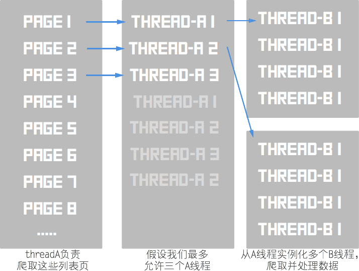

## [spider-threads](https://pypi.python.org/pypi/spider_threads)

[](https://travis-ci.org/ecmadao/spider-threads)

一个生成多线程的Python工具

### Rely

python3.5 +

### Install

**通过pip安装**

```bash
$ pip3 install spider_threads
```

**或者本地下载安装**

```bash
$ git clone https://github.com/ecmadao/spider-threads
$ cd spider-threads-master
$ python3 setup.py install 
```

### What can it do?

很可惜，它目前只是一个用来生成多线程的工具。通过它，可以便捷的从当前进程的主线程里产生出指定数目的多线程（简称A线程），然后再从每个多线程上产生指定数目的子线程（简称B线程）。

它的常用场景有：

爬虫爬取列表页，每个爬取列表页的线程都是一个A线程。在每个列表页上，你肯定会爬取到很多详情页的链接。从A线程返回这些详情页链接组成的list或tuple。接下来的工作就要交给B线程，它负责爬取详情页的数据，并储存在一个单例数据中。整体看起来差不多这样：




**请记住，它只是一个帮助你创建多个线程的工具，并不能创建爬虫。**因此，具体的爬虫实现需要我们自己去完成，并有如下约定：

- 爬虫实例化方法需要接受URL作为参数
- A线程上运行的爬虫需要通过`request_urls`方法返回详情页URL组成的列表或元组，B线程上运行的爬虫则通过`request_page`方法对页面进行爬取分析。至于数据的储存，则由使用者自行在爬虫中编写。

### Usage & Example

#### usage

[ThreadCreator](https://github.com/ecmadao/spider-threads/blob/master/spider_threads/entry.py)

```python
from spider_threads.entry import ThreadCreator

# ThreadCreator用于创建初始化一个线程池，接受子线程爬虫和主线程爬虫作为命名参数
threads = ThreadCreator(main_spider, branch_spider)
# example
# threads = ThreadCreator(main_spider=NpmSearchSpider, branch_spider=NpmPageSpider)

# 传入列表页URL组成的list或tuple，开启爬虫
threads.get_entry_urls(urls)
# 结束所有的线程
threads.finish_all_threads()
```

[message](https://github.com/ecmadao/spider-threads/blob/master/spider_threads/utils/message.py)

```python
from spider_threads.utils import message

# 接受String作为参数，打印出一段红色的error信息
message.error_message()

# 接受String, colro作为参数。具体用法见链接
message.colorful_text()
```

#### example

看个例子(代码中的[单元测试实例](https://github.com/ecmadao/spider-threads/tree/master/test))

```bash
# 创建如下目录
|-- database # 数据操作包，在测试中用于储存数据
|---- __init__.py
|---- database.py
|-- spiders # 爬虫包，编写的模拟爬虫放在这里
|---- __init__.py
|---- spider.py
|-- __init__.py
|-- test_threads.py # 调用spider-threads的入口文件
```

```python
# database.py
"""
用于控制数据操作
在测试案例中，主要用于储存B线程爬虫的返回值，以模拟详情页爬虫的数据处理和储存
database_creator用来确保仅生成一个database实例
"""
database = None


def database_creator():
    """make sure you have only one instance of Database

    :return: DataBase's instance
    """
    global database
    if database is None:
        database = Database()
    return database


class Database(object):
    def __init__(self):
        self.data = []

    def append_data(self, data):
        self.data.append(data)
```

```python
# spider.py
"""
编写两个模拟爬虫的类
MainSpider用于模拟A线程爬虫
BranchSpider用于模拟B线程爬虫
两个爬虫都要在实例化方法里接受URL作为参数
"""
from ..database.database import database_creator

class MainSpider(object):
    def __init__(self, url):
        self.url = url
        print('main spider {} start!'.format(url))

    def request_urls(self):
    	"""
    	确保request_urls方法返回一个URL组成的list或tuple
    	"""
        return ['{}-{}'.format(self.url, i) for i in range(5)]


class BranchSpider(object):
    def __init__(self, url):
        self.url = url
        print('branch spider {} start!'.format(url))

    def request_page(self):
    	"""
    	request_page被调用与分析爬取
    	"""
		database = database_creator()
        database.append_data('{}-object'.format(self.url))
```

```python
# test_threads.py
from .spiders.spider import MainSpider
from .spiders.spider import BranchSpider
from .database.database import database_creator

# 引用我们的ThreadCreator创建线程
from spider_threads.entry import ThreadCreator

URLS = [1, 2] # 模拟page URL


def test_threads():
    database = database_creator()
    
    # 实例化时传入A线程爬虫与B线程爬虫
    # 并通过get_entry_urls传入全部要爬取的列表页URL组成的list或tuple
    # finish_all_threads则将阻塞当前线程直至全部子线程爬取完毕
    thread_creator = ThreadCreator(main_spider=MainSpider, branch_spider=BranchSpider)
    thread_creator.get_entry_urls(urls=URLS)
    thread_creator.finish_all_threads()

    print('all thread finished')
    if database is not None:
        print(database.data)
```

### Project

使用了该插件的Python项目：

[npm-helper](https://github.com/ecmadao/npm-helper)

[spider-segmentfault](https://github.com/ecmadao/Spider-Segmentfault)